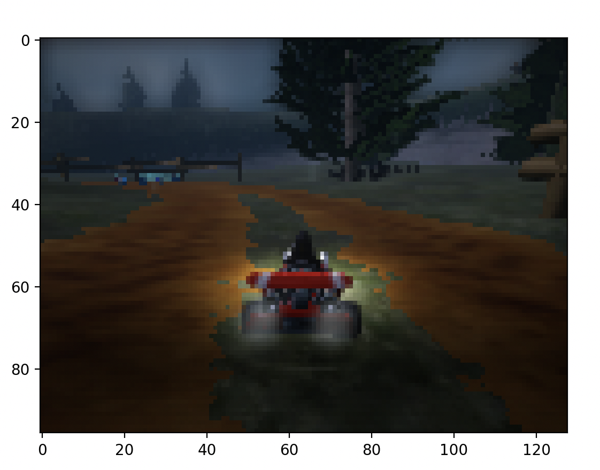
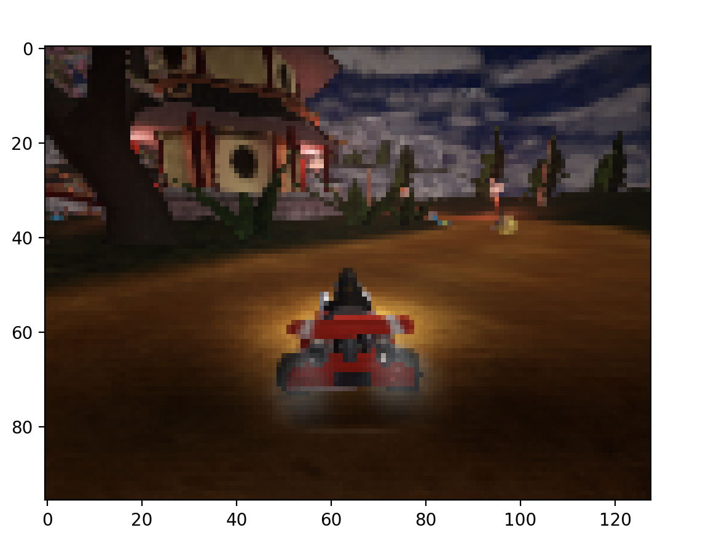
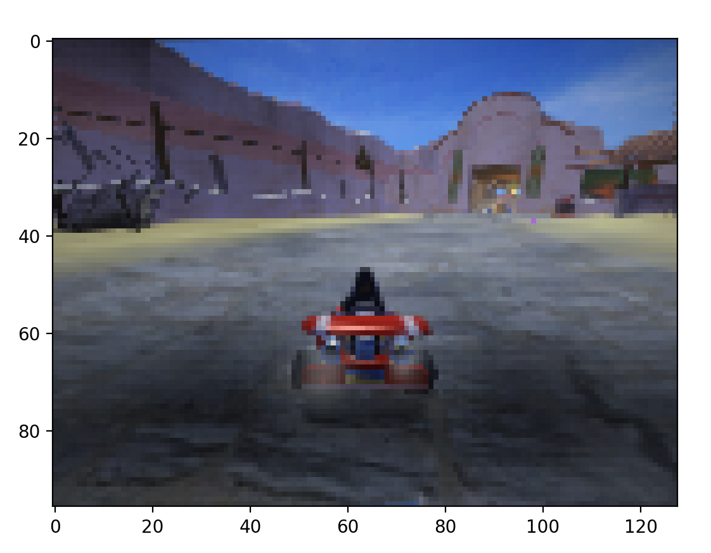
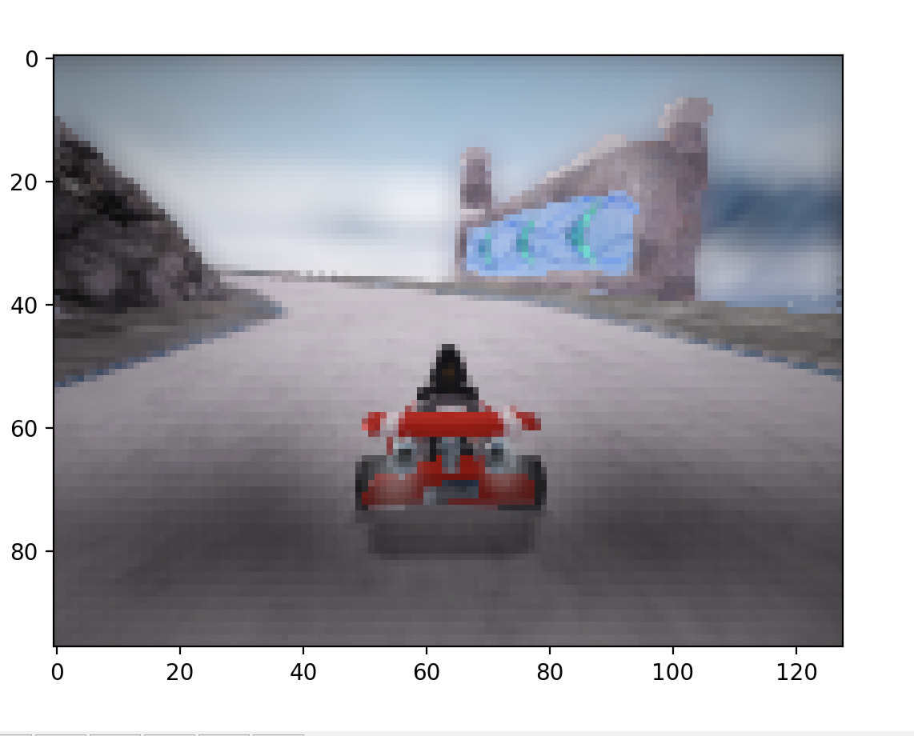
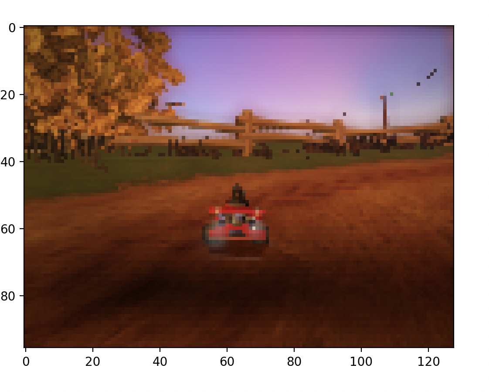
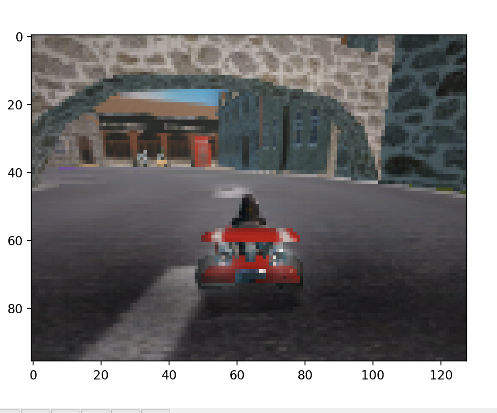

# EC523FinalProject

<table>
  <tr>
    <td align="center">
      <br>
      <b>lighthouse </b>b
    </td>
    <td align="center">
      <br>
      <b>zengarden</b>
    </td>
    <td align="center">
      <br>
      <b>hacienda</b>
    </td>
  </tr>
</table>

<table>
  <tr>
    <td align="center">
      <br>
      <b>snowtuxpeak</b>
    </td>
    <td align="center">
      <br>
      <b>cornfield_crossing</b>
    </td>
    <td align="center">
      <br>
      <b>scotland</b>
    </td>
  </tr>
</table>


Currently the biggest changes we made are in the kart_env.py file and marissa_test.py file.

To find kart_env.py go to EC523FinalProject/homework/kart_env.py
To find marissa_test.py go to EC523FinalProject/homework/marissa_test.py

## Gymnasium
The reason we decided to implement Gymnasium into this project is because it will make the implementations of policy gradient methods much easier. We plan on using CleanRL pre-defiend implementations to seamlessly integrate these policy gradient methods. In this way we can minimize errors in the actual implementation and not sink too much time into debugging.

## kart_env.py

This is a custom Gymnasium wrapper written for PySuperTuxKart. We created a class called SuperTuxKartEnv with functions __init__(), reset(), step(), and render(). The init functions initalizes the environment, the reset function defines how a reset will be preformed, the step function defines how to step through the environment (i.e. take an action, pick up an award, transition to next state), and the render function displays the race using matplotlib. A lot of this code was transferred and re-used from old code in utils.py. We are just redefining the way that the environment is driven, but big picture we are not changing to much. 

## marissa_try.py

This is the driver code, it basically runs a while loop until the race is done or times out. Here, you can specify which race track you want to use. The options are 'lighthouse', 'hacienda', 'zengarden', 'snowtuxpeak', 'cornfield_crossing', and 'scotland.' Here is a sample of how to run the code:
```
python3.10 marissa_test.py --track snowtuxpeak
```
 Here it is important to note that we are using a specific version of python, python 3.10. PySuperTuxKart is not compatible with newer versions of Python and the new Mac chips. As such, we had to use an emulator (in our case VS Code) to run an intel chip version of python. To specify which version of python we want to use, we added an alias in ourr .zprofiel for this specific python version which is python 3.10.
